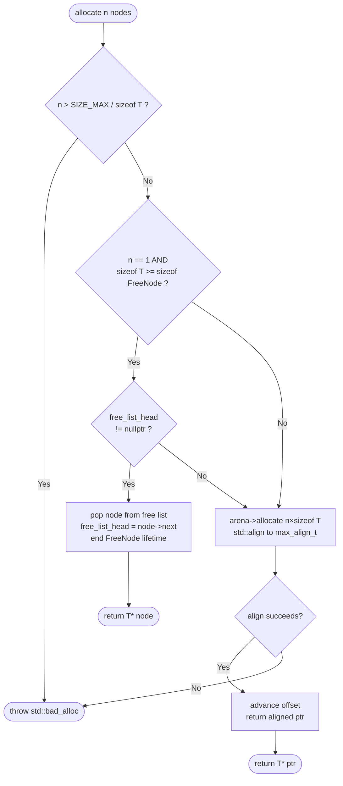
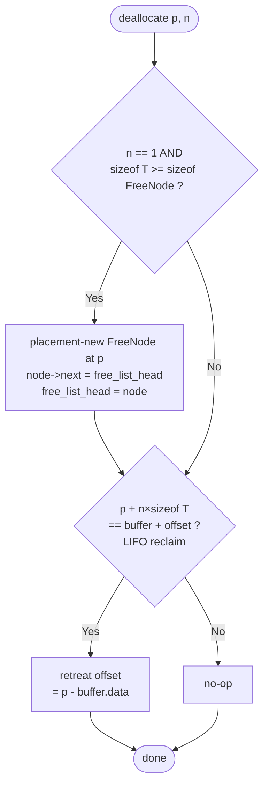
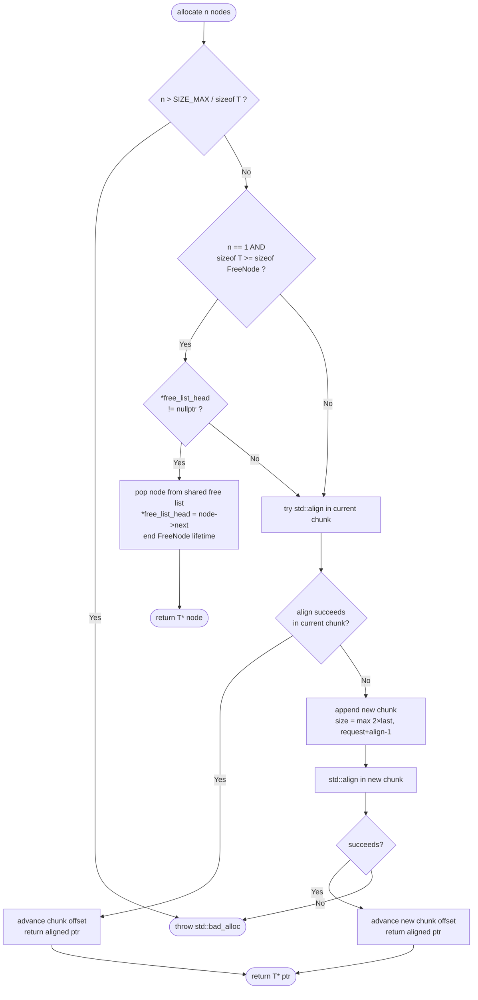
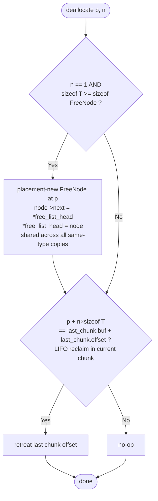
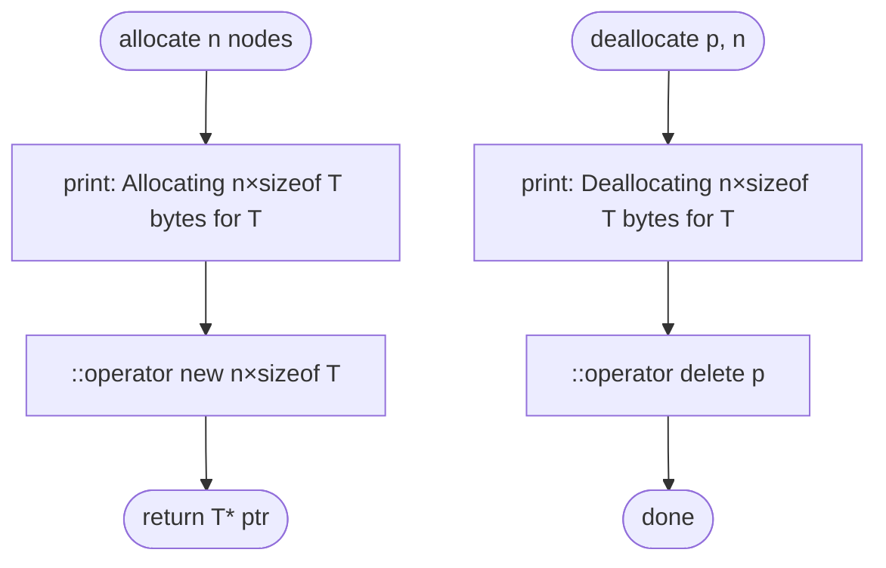

# ot-allocator

A collection of custom C++20 allocators conforming to the C++ named allocator requirements, usable as drop-in replacements for `std::allocator` in standard containers such as `std::vector`, `std::list`, and `std::map`.

---

## Allocators overview

### 1. `ArenaAllocator<T, N>` — stack-based arena allocator

**Header:** `src/lib/allocators/arena_alloc.hpp`

#### Structure

- **`MemoryArena<N>`** — fixed-size arena backed by a `std::array<std::byte, N>` living on the stack (or as a member).  A single `offset` integer tracks the bump pointer.
- **`ArenaAllocator<T, N>`** — STL-compatible allocator that owns a pointer to a `MemoryArena<N>` and an intrusive singly-linked free list for recycling single-element blocks.

The arena size `N` is a compile-time template parameter; the concept `MinimalArenaSize<N>` enforces `N > 0`.

#### Logic of work

1. **Bump allocation** — `MemoryArena::allocate(bytes)` advances `offset` to the next `alignof(std::max_align_t)`-aligned address and bumps it by the requested size. Cost: O(1).
2. **Free list (single-element reclaim)** — when `deallocate(p, 1)` is called and `sizeof(T) >= sizeof(FreeNode)`, the freed block is reused as a `FreeNode` and pushed onto an intrusive linked list embedded inside the freed memory itself (zero overhead).  The next `allocate(1)` pops from the list before touching the bump pointer.
3. **LIFO reclaim** — `MemoryArena::deallocate(p, bytes)` retreats `offset` only when the freed block is the most recently allocated one; otherwise it is a no-op.
4. **Bulk reset** — `ArenaAllocator::reset()` atomically clears the free list **and** resets `offset` to zero, reclaiming the entire arena. Calling `MemoryArena::reset()` directly without clearing the free list would cause stale free-list pointers to alias freshly bump-allocated storage (silent corruption), so direct `arena.reset()` is intentionally avoided.

#### Allocation algorithm



#### Deallocation algorithm



> **Note:** multi-element frees (`n > 1`) skip the free list and fall through directly to the LIFO reclaim check inside `MemoryArena::deallocate`.

#### Constraints

- Copy and move of `MemoryArena` are deleted — moving the buffer would dangle every pointer returned by previous allocations.
- Not suitable for over-aligned types whose alignment exceeds `alignof(std::max_align_t)`.
- Capacity is fixed at compile time; exhausting the arena throws `std::bad_alloc`.

---

### 2. `HeapArenaAllocator<T>` — heap-backed arena allocator

**Header:** `src/lib/allocators/heap_arena_alloc.hpp`

#### Structure

- **`HeapMemoryArena`** — runtime-sized arena backed by a `std::unique_ptr<std::byte[]>` allocated on the heap. Capacity is specified at construction time.
- **`HeapArenaAllocator<T>`** — STL-compatible allocator identical in design to `ArenaAllocator` but with no compile-time size parameter.

#### Logic of work

Identical to `ArenaAllocator`:

1. **Bump allocation** via `std::align` inside the heap buffer.
2. **Intrusive free list** for `n == 1` deallocations when `sizeof(T) >= sizeof(FreeNode)`.
3. **LIFO reclaim** for the most recently allocated block.
4. **Atomic reset** through `HeapArenaAllocator::reset()`.

#### Key difference from `ArenaAllocator`

The buffer lives on the heap, so the arena size is a runtime value and the arena object itself is lightweight (one pointer + two `size_t` members). This makes it suitable when the required capacity is not known at compile time or when a stack allocation of size `N` would be too large.

The allocation and deallocation algorithms are identical to `ArenaAllocator` — see the diagrams above.

---

### 3. `ChunkHeapArenaAllocator<T>` — growable chunked heap-arena allocator

**Header:** `src/lib/allocators/chunk_heap_arena_alloc.hpp`

#### Structure

- **`ChunkHeapMemoryArena`** — arena composed of a `std::vector<Chunk>`. Each `Chunk` holds a `std::unique_ptr<std::byte[]>` buffer, its capacity, and a bump offset. The vector stores `Chunk` structs (not raw buffers), so vector reallocation never invalidates previously returned pointers.
- **`ChunkHeapArenaAllocator<T>`** — STL-compatible allocator. The free list is stored as a `std::shared_ptr<FreeNode*>` so that all same-type copies of the allocator share the same free list; rebind copies (`U → T`) receive a fresh list for `T` to avoid aliasing differently-typed storage.

#### Logic of work

1. **Fast path** — attempts bump allocation from the current (last) chunk using `std::align`.
2. **Overflow / growth** — if the current chunk cannot satisfy the request, a new chunk is appended to the vector. New chunk capacity is `max(2 × last_capacity, request + alignment - 1)` to ensure the request always fits with worst-case alignment padding.
3. **Intrusive free list** — same single-element recycle strategy as the other arena allocators, but stored behind a `shared_ptr` so that all allocator copies for the same type `T` use one shared list.
4. **LIFO reclaim** — operates on the current (last) chunk only.
5. **Reset** — discards all extension chunks (keeping the original first chunk) and resets its offset to zero. The shared free list is also cleared atomically.

#### Allocation algorithm



#### Deallocation algorithm



> **Shared free list:** `free_list_head_` is a `std::shared_ptr<FreeNode*>`, so every same-type copy of the allocator recycles into and from the same list. Rebind copies for a different type `U` get their own independent list.

#### Constraints

- Requires `alignof(T) <= alignof(std::max_align_t)` (static assertion at instantiation); over-aligned types need a dedicated aligned allocator.
- Unlike the fixed-size arenas, this allocator never throws `std::bad_alloc` due to capacity exhaustion — it simply appends a new chunk (subject to available system memory).

---

### 4. `LogAllocator<T>` — logging allocator

**Header:** `src/lib/allocators/log_alloc.hpp`

#### Structure

A minimal stateless allocator that wraps `::operator new` / `::operator delete` and prints diagnostic information to `std::cout` for every allocation and deallocation.

#### Logic of work

1. **`allocate(n)`** — prints `"Allocating <n*sizeof(T)> bytes for <mangled type name>"`, then calls `::operator new(n * sizeof(T))` and returns the pointer.
2. **`deallocate(p, n)`** — prints `"Deallocating <n*sizeof(T)> bytes for <mangled type name>"`, then calls `::operator delete(p)`.

All instances of `LogAllocator<T>` compare equal (`operator==` returns `true`) because all instances are stateless and use the same global heap. This satisfies the `is_always_equal` semantic without the explicit typedef.

#### Algorithm



#### Use case

Intended for development and debugging — replacing the allocator in a container with `LogAllocator<T>` reveals exactly when and how much memory is allocated, which is useful for understanding container growth strategies or verifying that custom allocators avoid unexpected heap calls.

---

## Comparison table

| Allocator | Buffer location | Capacity | Grows? | Thread-safe? | Free list |
|---|---|---|---|---|---|
| `ArenaAllocator<T,N>` | Stack / member | Compile-time `N` | No | No | Intrusive, per-instance |
| `HeapArenaAllocator<T>` | Heap | Runtime, fixed | No | No | Intrusive, per-instance |
| `ChunkHeapArenaAllocator<T>` | Heap (chunked) | Runtime, growable | Yes | No | Intrusive, shared among copies |
| `LogAllocator<T>` | Global heap | Unlimited | Yes | Depends on `::operator new` | None |

---

## Usage example

```cpp
#include "allocators/arena_alloc.hpp"
#include "allocators/heap_arena_alloc.hpp"
#include "allocators/chunk_heap_arena_alloc.hpp"
#include "allocators/log_alloc.hpp"
#include <vector>
#include <list>

// Stack-based arena — capacity known at compile time
MemoryArena<4096> stack_arena;
std::vector<int, ArenaAllocator<int, 4096>> v1{ArenaAllocator<int, 4096>{stack_arena}};

// Heap arena — capacity chosen at runtime
HeapMemoryArena heap_arena{4096};
std::list<int, HeapArenaAllocator<int>> l1{HeapArenaAllocator<int>{heap_arena}};

// Chunked heap arena — auto-grows when capacity is exceeded
ChunkHeapMemoryArena chunk_arena{1024};
std::vector<int, ChunkHeapArenaAllocator<int>> v2{ChunkHeapArenaAllocator<int>{chunk_arena}};

// Logging allocator — wraps global heap, prints every alloc/dealloc
std::vector<int, LogAllocator<int>> v3;
```
